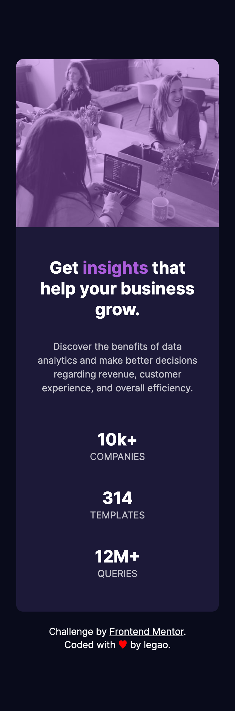

# Frontend Mentor - Stats preview card component solution

This is a solution to the [Stats preview card component challenge on Frontend Mentor](https://www.frontendmentor.io/challenges/stats-preview-card-component-8JqbgoU62).

## Table of contents

- [Overview](#overview)
  - [The challenge](#the-challenge)
  - [Screenshot](#screenshot)
  - [Links](#links)
- [My process](#my-process)
  - [Built with](#built-with)
  - [What I learned](#what-i-learned)
  - [Useful resources](#useful-resources)
- [Author](#author)

## Overview

### The challenge

Users should be able to:

- View the optimal layout depending on their device's screen size

### Screenshot

### Links

- Solution URL: [Add solution URL here](https://your-solution-url.com)
- Live Site URL: [Add live site URL here](https://your-live-site-url.com)

## My process

### Built with

- Semantic HTML5 markup
- scss
- Mobile-first workflow

### What I learned

- style html using sass
- sass variables
- add foreground color to images using absolute positioning

### Useful resources

sass related vscode extensions

- [Sass](https://marketplace.visualstudio.com/items?itemName=Syler.sass-indented)

- [Live Sass Compiler](https://marketplace.visualstudio.com/items?itemName=ritwickdey.live-sass)

## Author

- Frontend Mentor - legao[@yikayiyo](https://www.frontendmentor.io/profile/yikayiyo)
